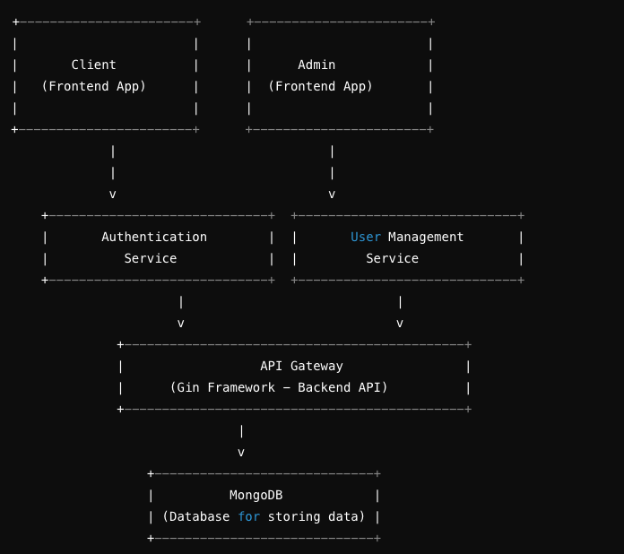
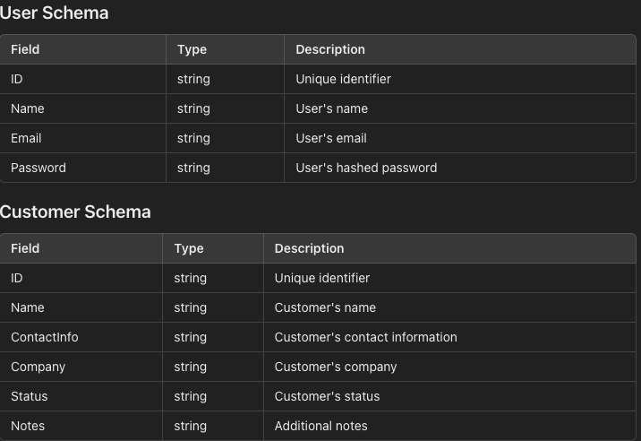
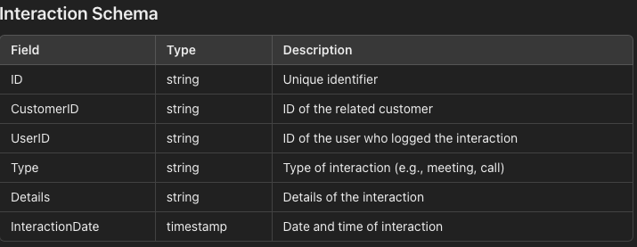

# CRM Backend System by Vatsal

This is a backend system for a CRM application with advanced features such as user authentication, customer and lead management, interaction tracking, and advanced analytics.

## Features

- User Management (CRUD operations for users)
- Customer Management (CRUD operations for customers)
- Interaction Tracking (Log interactions with customers)
- Analytics and Reporting (Generate reports on interactions)
- User Authentication (JWT-based authentication)
- Role-based access control (Admin and regular users)

## Setup and Installation

### Prerequisites

- Go (version 1.16 or higher)
- MongoDB (running on `localhost:27017`)

### Installation

1. Clone the repository:

    ```bash
    git clone https://github.com/yourusername/crm-backend.git
    cd crm-backend
    ```

2. Install dependencies:

    ```bash
    go mod tidy
    ```

3. Start MongoDB (if not already running):

    ```bash
    # For macOS (using Homebrew)
    brew services start mongodb-community@5.0

    # For Linux (using systemctl)
    sudo systemctl start mongod

    # For Windows (using Command Prompt)
    net start MongoDB
    ```

4. Run the application:

    ```bash
    go run main.go
    ```

### API Endpoints

- `GET /` - Welcome message
- `POST /register` - Register a new user
- `POST /login` - Login a user and receive a JWT
- `POST /users` - Create a new user
- `GET /users/:id` - Get user details
- `PUT /users/:id` - Update user details
- `DELETE /users/:id` - Delete a user
- `POST /customers` - Create a new customer
- `GET /customers/:id` - Get customer details
- `PUT /customers/:id` - Update customer details
- `DELETE /customers/:id` - Delete a customer
- `POST /interactions` - Create a new interaction
- `GET /customers/:id/interactions` - Get interactions for a customer
- `GET /interactions/stats` - Get interaction statistics






### Running Tests

To run tests, use the following command:

```bash
go test ./...

